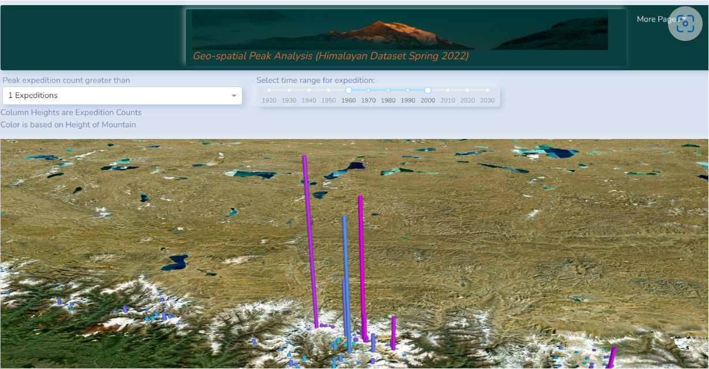
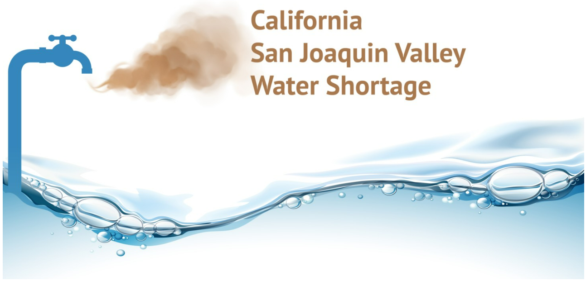

## Supply Chain Intelligence

Analysis turns data into business information, or information that is actionable, relevant, reliable, and placed in context.

> 
[Analytics Portfolio](https://github.com/sjtalkar/sjtalkar.github.io/blob/main/Spur%20Into%20Action%20Read%20Only.pdf)

*********************************************************************************

## Capstone

[Capstone Report](http://umsi-mads-capstone-himalayas.s3-website-eu-west-1.amazonaws.com/citations.html)|[Capstone EDA Insights](https://github.com/sjtalkar/capstone_dashboard/blob/main/docs/insights_from_eda.md)|
[Natural Language Processing of Reddit and Twitter posts on Scaling Mt. Everest](https://dagshub.com/sjtalkar/capstone_himalayas/src/main/notebooks/04_reddit_intent_discovery_berttopic.ipynb)

*********************************************************************************
## Milestone

[Milestone 2 Streamlit App](https://sjtalkar-milestone2-streamlit-milestone2-app-g8fn85.streamlit.app/)|[Code for Milestone 2 project](https://github.com/sjtalkar/milestone2_waterwells_deepnote)

**********************************************************************************

[Medium Articles](https://sjtalkar.medium.com/)

